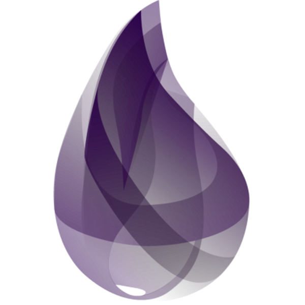

<h1 align="center">
    
</h1>

<h4 align="center">
  💧 Elixir Study
</h4>

<a href="#tecnologias">Tecnologias</a>&nbsp;&nbsp;&nbsp;|&nbsp;&nbsp;&nbsp;
<a href="#-projeto">Projeto</a>&nbsp;&nbsp;&nbsp;|&nbsp;&nbsp;&nbsp;
<a href="#-layout">Layout</a>&nbsp;&nbsp;&nbsp;|&nbsp;&nbsp;&nbsp;
<a href="#-como-contribuir">Como contribuir</a>&nbsp;&nbsp;&nbsp;|&nbsp;&nbsp;&nbsp;
<a href="#memo-licença">Licença</a>

 

## :octocat: Tecnologias

Esse projeto vai utilizar as seguintes tecnologias:

- [Git](https://git-scm.com/)
- [Elixir](https://elixir-lang.org//)
- [Phoenix](https://www.phoenixframework.org/)

## 📄 Conteúdo
Para estudo será utilizado como padrão o [Elixir School](https://elixirschool.com/pt/) mas também é recomendado estudar
por materiais complementares como:

- [Elixir Doc](https://elixir-lang.org/getting-started/introduction.html)
- [Elixir in Action](https://www.manning.com/books/elixir-in-action-second-edition)
- [Phoenix Doc](https://hexdocs.pm/phoenix/Phoenix.html)

## 🔖 Regras
- Crie uma pasta com seu nome
- Dentro da sua pasta coloque o nome do assunto (modulo) que você está estudando

## 💻 Objetivo
Aprendizado da linguagem elixir e da framework phoenix pelo [Elixir School](https://elixirschool.com/pt/)

## 🤔 Como contribuir
Utilizamos git flow, entretanto O Git Flow não é uma ferramenta padrão do Git, e por esse motivo precisamos antes de tudo realizar a instalação do plugin.

No [github](https://github.com/nvie/gitflow/wiki/Installationhttps://github.com/nvie/gitflow/wiki/Installation) tem o passo a passo de como instalar em todos os ambientes.

- Faça um fork desse repositório;
- Digite:  git flow init
- Depois: git flow feature start novo_codigo
- Para finilizar utilize: git flow feature finish novo_codigo
- Para gerar a versao: git flow release start 1.0.0
- Para finalizar a versao: git flow release finish 1.0.0
- Para enviar o github: git push origin master

## :memo: Licença

Esse projeto está sob a licença MIT. Veja o arquivo [LICENSE](LICENSE) para mais detalhes.

---

Feito com ❤️ by Eureka.Sun
